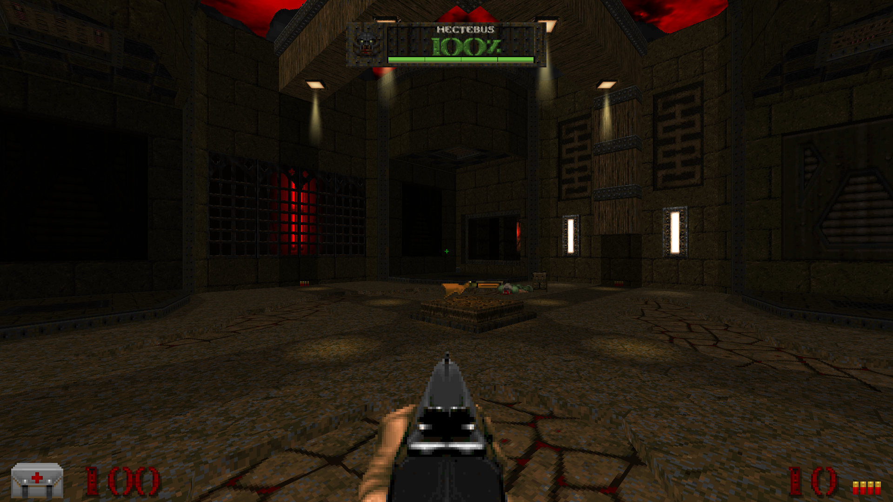

# UTNT: Bossplakette mit Originalporträts

Die Bossanzeige verbindet die originalen UTNT-Metallboxen mit Bossnamen, einer großen Prozentzahl und einem eingelassenen Lebensbalken. Die fünf Originalrahmen werden vollständig gezeichnet; es gibt keine nachgezeichneten Gesichter. Seit der beauftragten PLAYPAL-Umstellung liegen sie wieder als originale Doom-LMPs vor und folgen der globalen Palette (siehe [Palettenbericht](UTNT_PALETTE.md)). ZScript ergänzt ausschließlich Text, Balken und Schildsymbol.



## Zuordnung und Darstellung

| Originalgrafik | Boss | Ursprüngliche Begegnung |
| --- | --- | --- |
| M_HPB1.lmp | Hectebus | TNT01 |
| M_HPB2.lmp | Bruiser Demons | TNT02 |
| M_HPB3.lmp | Portal Guards | TNT03B |
| M_HPB4.lmp | The Queen | TNTLE |
| M_HPB5.lmp | The Source | TNT04C / TNT04CN |

Die historischen SHA-256-Werte in `original-portraits.json` beschreiben den gelieferten PNG-Stand vor der später beauftragten Palettenumstellung. Der aktuelle LMP-Dateimanifest liegt im Palettennachweisverzeichnis. Die PNG-Kopien der fünf Rahmen wurden entfernt.

- Rahmen: native 142 × 32 Pixel, horizontal zentriert, Oberkante bei 4,5 % der Bildhöhe. Skalierung über die kleinere Bildschirmachse, mindestens native Größe. Eingebettete Patch-Offsets werden beim Zeichnen explizit überschrieben.
- Name: vorhandene lokalisierte Bossnamen, warme helle SmallFont; lange Namen passen sich in der Breite an.
- Prozent: vorhandene DBIGFONT; aktueller HP-Wert aufgerundet, von 0 bis 100 begrenzt. Der Zahlenwert folgt dem Schaden sofort, der Balken gleitet nach.
- Zahl und Balken interpolieren stufenlos zwischen Grün bei 100 %, Gelb bei 60 %, Orange bei 30 % und Rot bei 10 %. Unter 10 % bleibt die Anzeige rot.
- Ein dunkler Schadensnachlauf bleibt zunächst acht UI-Ticks stehen und läuft dann aus. Reduzierte Effekte lassen beide Balken direkt auf den aktuellen Wert springen.
- Die unverwundbare Source erhält ein kleines blaues Schild innerhalb der Box; ihre HP-Farbe bleibt erhalten.
- Die vorhandenen Optionen `UTNT_bosshud` und `UTNT_bosspercent` gelten weiterhin. Zwischensequenzen und vollständig eingefrorene Spieler blenden die Bossanzeige aus. Nach dem Tod endet sie wie bisher nach 70 Spielticks, die letzten 35 davon mit Ausblendung.

Die Änderung betrifft `UTNT_BossHUD.zc`, dessen Einbindung und die lokale Darstellung in `UTNTPresentation`. Boss-Actors, ACS-Adapter, Gruppen-HP, gespeicherte Weltzustände und Abschlussaktionen bleiben unverändert. Beim Laden/Kartenwechsel wird die lokale Balkenanimation auf den gespeicherten HP-Wert zurückgesetzt.

## Prüfung am 07.09.2026

UZDoom 5.0.1, Windows, OpenGL und Vulkan:

- Kompilierung des Mods, des Test-Add-ons und beider PK3-Pakete bestanden.
- Das endgültige lokale PK3 und zusätzlich das isolierte HUD-Paket bestehen die vollständige HUD-Testfolge mit jeweils 30 Assertions auf beiden Renderern: fünf Porträts, vier Farbpunkte, Begrenzung ungültiger Werte, Schadensnachlauf, Prozentoption, Schildzustand, reduzierte Effekte, gespeicherter aktiver Boss und Todesfrist.
- Originale Boss-Startskripte in TNT01, TNT02, TNT03B, TNTLE, TNT04C und TNT04CN mit dem isolierten Paket ausgeführt: alle sechs registrieren lebende Bosse; zwölf Assertions bestanden.
- Laufzeitaufnahmen bei 960 × 540, 1920 × 1080 und 1024 × 768 geprüft. Originalporträts, Schild, Prozentoption, Cutscene-/HUD-Ausblendung und Todes-Fade visuell kontrolliert. Die beiden zusätzlichen Auflösungen werden über den PNG-Header automatisch verifiziert.
- Alle 14 ACS-Module mit ACC reproduziert; keine Bytecodeänderung.

Die erste Fassung des Timing-Tests prüfte unmittelbar zwei Konsolen-Wartezyklen nach einem Netzwerkereignis. Im Paketlauf war der Spielzustand bereits aktualisiert, der nächste UI-Tick aber noch nicht ausgeführt. Der abschließende Test beobachtet den tatsächlich aufgetretenen Nachlauf in `PostUiTick`, bevor er ihn nach zwölf Wartezyklen bewertet. Der HUD-Code musste dafür nicht geändert werden.

Reproduzierbar mit konfigurierten `UTNT_ENGINE` und `UTNT_IWAD`:

```text
python tools/test_boss_hud.py
python tools/test_boss_hud.py --mod tutnt.pk3
```

Das Test-Add-on unter `tools/boss-hud-tests` wird nicht mit dem Spiel ausgeliefert. Protokolle, ausgewählte unveränderte Engine-Aufnahmen und Hashmanifest liegen in `tools/validation/boss-hud-2026-09-07`. Die ursprünglichen Begegnungsstarts verwenden das bereits bestehende Add-on `tools/campaign-tests`; die umfassendere Kampagnenprüfung lässt sich mit `python tools/test_campaign.py` wiederholen.

Diese Abnahme prüft die Bossanzeige und die ursprünglichen Begegnungsstarts. Sie ist keine erneute vollständige Kampagnen- oder Mehrspielerabnahme; die zugrunde liegenden Spiel-/Netzwerkpfade wurden hier nicht verändert.

## Pakete und vorhandene lokale Änderungen vor der Balkenkorrektur

- Lokales `tutnt.pk3`: 8779 Einträge, 84907607 Bytes, SHA-256 `059c4cd5eb864d073f67f588370dde49b46b823d8aa45d8c34068be8230bdc78`. Es bildet den aktuellen Quellbaum einschließlich der vom Nutzer in `af649be7f` committeten PNG-Grafikkonvertierungen ab.
- Zusätzlich geprüftes isoliertes Paket aus `01557144c` plus ausschließlich dieser HUD-Umsetzung: 8779 Einträge, 82331622 Bytes, SHA-256 `3ae4f76b6bac342e9a50a9e54cad7199a7218500d5d5da77b73721bba63e33c9`. Dieses Paket verwendet für die übrigen Schriftgrafiken den bisherigen Git-Stand. Damit ist die HUD-Umsetzung zusätzlich unabhängig von den übrigen Grafikkonvertierungen geprüft.

Während der Arbeit hat der Nutzer die Grafikkonvertierungen einschließlich der bereits implementierten Bossanzeige mit `af649be7f` committet und auf den bisherigen Branch gepusht. Dieser Stand wurde anschließend wie beauftragt per Fast-Forward in `master` integriert. Die abschließende Testkorrektur und diese Nachweise werden direkt auf `master` committet; zukünftige Umsetzungen erfolgen ebenfalls direkt dort. AGENTS.md, Referenzquellen, lokale Konfigurationen, Engine, IWAD und Build-Pakete bleiben ausgeschlossen.

## Balkenkorrektur nach Screenshot — 07.09.2026

Der Balken sitzt jetzt vollständig innerhalb der Originalvertiefung. Sein äußerer Rahmen belegt native Pixel x=29..133 und y=24..28; Füllung, Schadensnachlauf und Teilstriche verwenden gemeinsam x=30, y=25 und Breite 103. Dadurch verschwinden der bisherige Versatz nach rechts und die Überstände am rechten sowie unteren Rand. Die Originalgrafiken und alle anderen HUD-Elemente bleiben unverändert.

Frischer PK3-Build und vorhandene HUD-Testfolge unter UZDoom 5.0.1/Vulkan bestanden: 30 Assertions. Ausrichtung bei 960 × 540, 1920 × 1080 und 1024 × 768 kontrolliert; 14 ACS-Module weiterhin byteidentisch. Nachweise: `boss-inset-*` im obigen Nachweisverzeichnis.

Aktuelles lokales Paket: 84917073 Bytes, SHA-256 `f061d1c8177bae05040ea7baff05dd3657d836736a67cada19583913a6f03d9c`. Es enthält auch die während der Arbeit vorgefundene lokale Änderung an `PLAYPAL.pal`; diese gehört nicht zur Balkenkorrektur und wird von ihr nicht committet.
