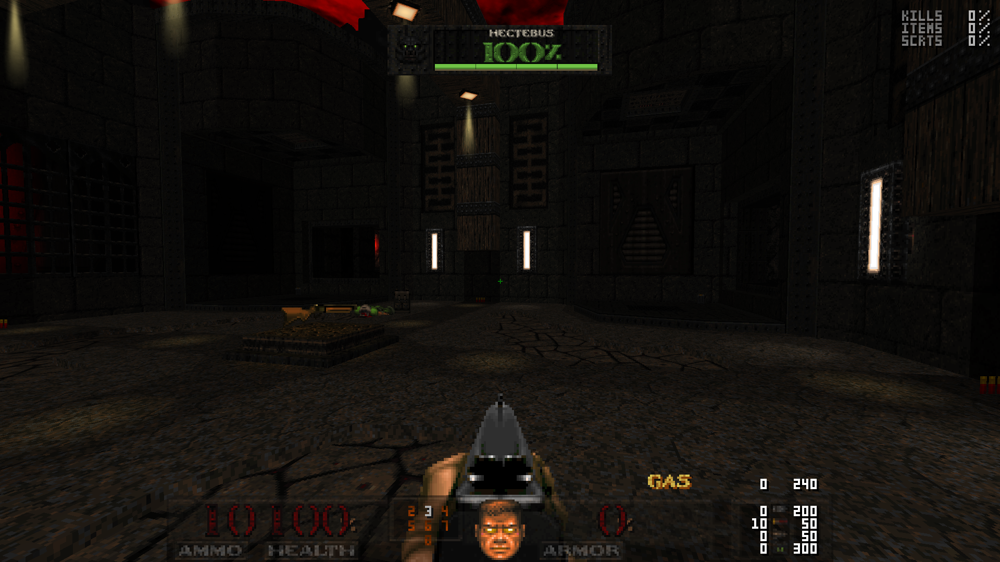
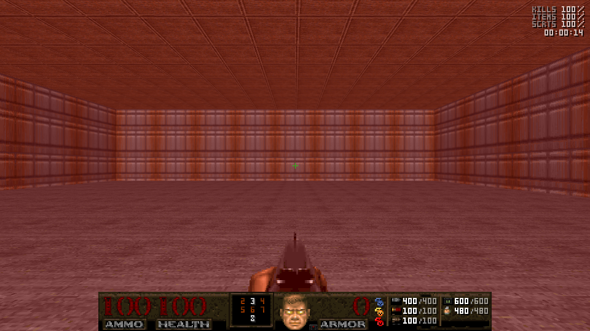
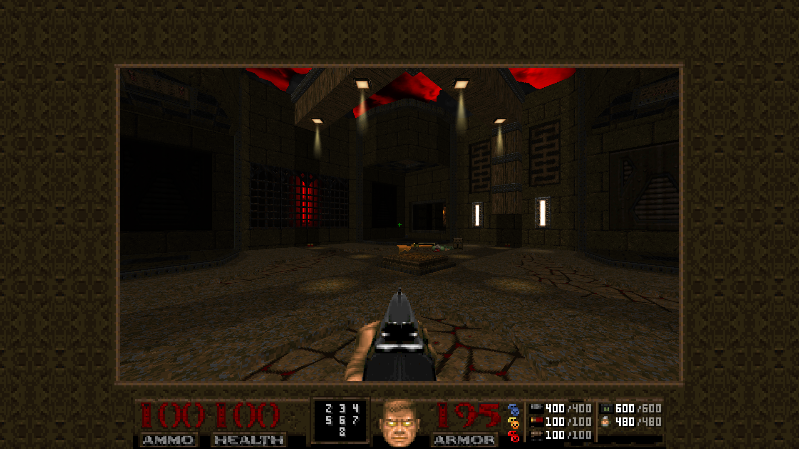
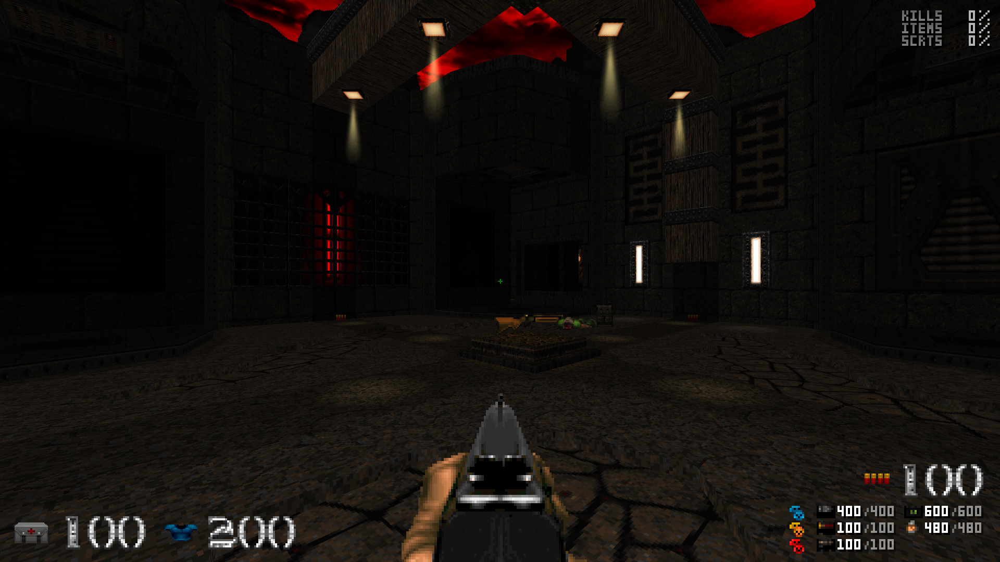
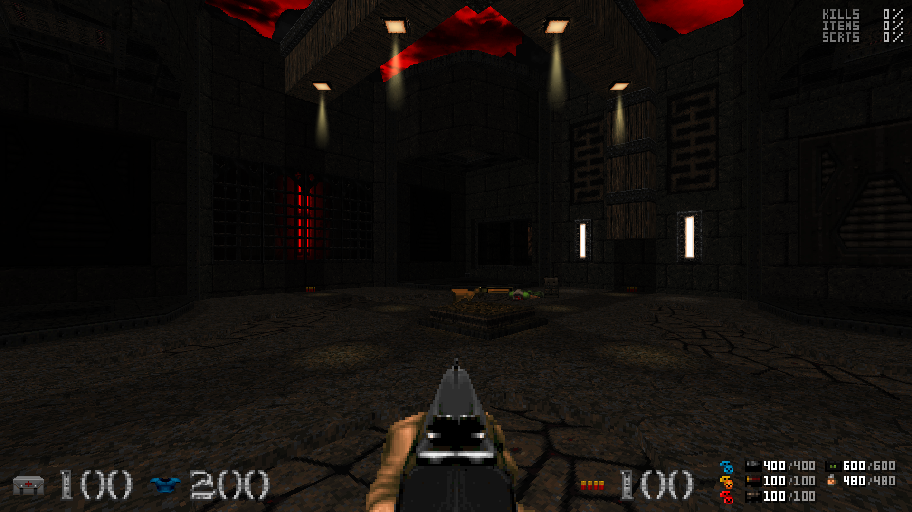

# UTNT: TNTLE-Statusleiste für UZDoom 5.0.1

Die Statusleiste aus `tntle.released_v20-20240306/sbarinfo.txt` ist mit ihrem Statistiksystem in UTNT integriert. Gestaltung und ursprünglicher SBARINFO-Code stammen von NightFright, mit Beiträgen von DTDsphere und m8f. Die vorhandene UTNT-Leistengrafik und die großen UTNT-Ziffern werden weiterverwendet.

## Bedienung

Unter **Options ‚Üí UTNT Remaster ‚Üí Statusleiste und Statistik** stehen folgende lokale Einstellungen bereit:

| CVar | Bedeutung | Standard |
| --- | --- | --- |
| `fullhud_stats` | 0 aus, 1 Prozent, 2 Prozent und Zeit, 3 verbleibend, 4 verbleibend und Zeit | 1 |
| `fullhud_statspos` | 0 oben links, 1 oben rechts, 2 unten links, 3 unten rechts | 1 |
| `fullhud_fullstats` | Gegenstände zusätzlich zu Monstern und Geheimnissen anzeigen | true |
| `fullhud_mugswitch` | Gesicht anzeigen, wenn kein benutzbarer Inventargegenstand ausgewählt ist | true |
| `fullhud_berserk` | Kleine Berserker-Anzeige | true |
| `fullhud_interpolate` | Lebens- und Rüstungsziffern glätten | true |
| `UTNT_hudtranslucent` | Halbtransparenter Hintergrund bei Screen Size 11 | true |

Die normale Leiste ist deckend; der Vollbild-Hintergrund lässt sich umschalten. Aktuelle Werte, Schlüssel und Gesicht bleiben deckend; Munitionskapazitäten erscheinen mit 52 % Deckkraft als sekundäre Information. Die Automap verwendet die normale Leiste. Die vom Spiel vorgesehenen Bildschirmgrößenregler bleiben nutzbar. Inventar und Gesicht teilen sich das mittlere Feld; die Gesichtsoption unterdrückt keine benutzbaren Gegenstände. Deutsche und englische Menütexte sind enthalten.

Gasmunition einschließlich Kapazität ist zusätzlich zu den vier Doom-Munitionsarten sichtbar. Waffenplatz 8 für die Pyro Cannon ergänzt die Waffenübersicht. Eine aktive Waffe mit zwei Munitionsarten erhält zwei getrennte Zähler. Kooperative und Deathmatch-Leisten verwenden die übersetzbare Spielerfarbe; Deathmatch zeigt Frags statt Waffenbesitz.

## Integration und Korrekturen

- `TEXTURES.txt` setzt das Waffenfeld aus der Originalgrafik `STARMS` zusammen: Der obere Teil bleibt unverändert, Seiten und unterer Rahmen werden um sieben Pixel verlängert beziehungsweise versetzt. Damit liegt Waffenplatz 8 vollständig innerhalb des Rahmens. Einzelspieler und Koop verwenden dieselbe Korrektur; die Palettenindizes der Originalgrafik bleiben erhalten.
- `SBARINFO.txt` enthält die Darstellung. Nicht verwendete Split-/Boom-Einstellungen der Vorlage werden nicht als funktionslose Optionen übernommen. Normal- und Vollbildblöcke sind absichtlich parallel aufgebaut: SBARINFO unterstützt hier keine wiederverwendbaren inneren Blöcke.
- `FONTDEFS.txt` und `graphics/statsfont` bringen die Statistikschrift mit. Die vier Statistikbeschriftungen stammen unverändert aus der Vorlage. Kleine Waffenziffern erhalten eigene `UTNHG*`-/`UTNHY*`-Namen, weil UTNTs bisherige graue Ziffern unsichtbare 1×1-Platzhalter sind. Vorhandene Schriftgrafiken werden nicht überschrieben.
- Die fehlende Ressource `BERSERK` der Vorlage wird durch die eigene, aus dem Doom-Berserkerpaket zusammengesetzte Grafik `UTNTHBS` ersetzt. Health und Armor zeigen ausschließlich ihre großen Ziffern; die zusätzlich gezeichneten SmallFont-Prozentzeichen wurden entfernt. Kleine Munitionswerte verwenden die lesbare Statistikschrift.
- Die Uhrzeit benutzt rechts einen festen linken Anker für acht gleich breite Zeichen. Im [SBARINFO-Code von UZDoom 5.0.1](https://github.com/UZDoom/UZDoom/blob/5.0.1/src/g_statusbar/sbarinfo_commands.cpp) aktualisiert `TIME` seinen String ohne erneute Ausrichtung. Eine dynamische Rechtsausrichtung führt dort zu einem Überlauf über den Bildschirmrand.
- Das gemeinsame ACS-Modul berechnet Globals 51–56 in genau einer `UTNT_HUDStats`-OPEN-Schleife pro Karte. Alle acht Spielticks werden die aktuellen Kartenwerte gelesen; Spielerzahl, Respawns und die lokale Sichtbarkeit erzeugen keine zusätzlichen Schleifen. Leere Kategorien ergeben 100 %, überzählige Kills keine negativen Restwerte. Die Statistikziffern werden nicht verzögert interpoliert.
- `UTNTHUDHidden` verbindet SBARINFO mit `UTNTPlayerEffects`: explizite Cutscenes, vollständig eingefrorene Spieler, skriptgesteuerte Nichtspieler-Kameras sowie INTERMAP/ENDMAP01 blenden Leiste, Statistik und Inventarleiste aus. Der Marker wird nur bei Zustandswechseln erzeugt oder entfernt und ist kein benutzbarer Gegenstand. Die bestehenden Cutscene-Aufrufe synchronisieren ihn unmittelbar.
- `UTNT_reducedfx` schaltet auch die neue Ziffernglättung aus. Bestehende Boss-, Untertitel- und Effektoptionen bleiben erhalten.

Die Globals sind für das HUD reserviert. Die Statistik ist kartenweit, einschließlich Koop; es handelt sich nicht um persönliche Killzahlen oder eine Summe über die gesamte Hub-Kampagne. Neue und in dieser Fassung gespeicherte Spielstände wurden geprüft; ein Spielstand aus einer früheren Version startet neu hinzugefügte OPEN-Skripte nicht rückwirkend. Für solche Spielstände ist ein Kartenneustart/-wechsel erforderlich, bevor die neue Statistikschleife läuft.

## Nachweise vom 07.09.2026

- Frischer PK3-Build; alle 14 ACS-Module reproduziert. Nur das gemeinsame `acs/tutnt.o` ändert sich durch die HUD-Erweiterung; die 13 eingebetteten Kartenmodule bleiben byteidentisch.
- UZDoom 5.0.1, geprüftes PK3: **53 Assertions auf OpenGL und 53 auf Vulkan**. Enthalten sind echte Spawn-/Kill-Statistikänderungen, leere Kategorien, Ressourcen, Speichern/Laden einer aktiven Cutscene, Freeze-/Kamerawechsel und Kartenwechsel.
- Aufnahmen bei 960×540, 1920×1080, 1024×768 und 2560×1080; normale/Vollbild-/Automap-Leiste, Statistikpositionen, Inventar mit ausgeschaltetem Gesicht, HUD-Ausblendung und aktive Zweitmunition kontrolliert. Die drei großen Auflösungen werden anhand der PNG-Abmessungen geprüft.
- Bestehender Boss-HUD-Test mit neuem PK3: **30 Assertions**. Scout und Commando im HUD-Test: **je 36 Assertions**.
- HUD-spezifischer Koop-Test mit zwei echten lokalen Peers: **je 48 Assertions**, einschließlich getrennter lokaler Statistikoptionen und Cutscene-Zustände.
- Isolierte HUD-Pakete aus `dedaaaccc` und dem während der Arbeit hinzugekommenen Grafikstand `c89371780`: vollständige Vulkan-HUD-Testfolge jeweils mit **53 Assertions** bestanden. Das zweite Paket entspricht den HUD-Commitdateien auf dem aktualisierten master-Grafikstand.
- Bestehende Strukturprüfung: **776 Prüfungen**; insbesondere Karteninhalte, Boss-Abschlussaktionen und Sprachschlüssel.

Der ältere allgemeine Koop-Test konnte im parallel veränderten Arbeitsverzeichnis nicht kompilieren, weil sein Effekt-Test-Add-on noch `UTNTFlameVisual` referenziert. Diese unabhängige Änderung wird hier nicht repariert. Der neue Koop-Test verwendet ausschließlich das HUD-Test-Add-on und das zuvor gebaute Paket. Eine erneute vollständige Kampagnenabnahme ist nicht Bestandteil dieser HUD-Prüfung.

Reproduzierbar mit gesetztem `UTNT_ENGINE`, `UTNT_IWAD` und optional `UTNT_ACC`:

```text
python tools/build_utnt.py
python tools/test_statusbar.py --mod tutnt.pk3
python tools/test_statusbar_coop.py --mod tutnt.pk3
python tools/test_boss_hud.py --mod tutnt.pk3 --renderer 1
```

Testquellen stehen unter `tools/statusbar-tests`; `test_statusbar.py` kompiliert das Test-ACS und kopiert die bestehende Regressionstestkarte automatisch. Das Add-on gelangt nicht ins Spiel-PK3. Die isolierte Testkonfiguration deaktiviert Hintergrundpausen; ein vorheriger Vulkan-Lauf pausierte nach Fokusverlust und erreichte deshalb sein Zeitlimit. Mit der korrigierten Testkonfiguration bestehen beide Renderer.

Ausgewählte unveränderte Engine-Aufnahmen, Ergebnisdateien und Paket-/Ressourcenhashes liegen unter `tools/validation/statusbar-2026-09-07`. Das lokale `tutnt.pk3` enthält den Arbeitsstand beim Build einschließlich parallel bearbeiteter Grafiken. Der HUD-Commit nimmt diese fremden Änderungen nicht auf; dafür wurde zusätzlich ein Paket aus dem vorherigen Git-Stand plus ausschließlich den HUD-Dateien erstellt und geprüft.

Das separat abgelegte `tutnt-hud-validated.pk3` enthält den Stand `c89371780` plus ausschließlich diese HUD-Änderungen: 8811 Einträge, 82073464 Bytes, SHA-256 `73e7ba9af87f1161db455251b008b1258bec9c71a4b5181c08f23dbec6dd9463`. Das parallel weiterbearbeitete `tutnt.pk3` wird dadurch nicht überschrieben.



## Nachkorrektur: Prozentzeichen und Waffenrahmen

Am 07.09.2026 wurden die Health-/Armor-Prozentzeichen entfernt und der Waffenrahmen für die dritte Zahlenzeile verlängert. `python tools/test_statusbar.py --renderer 1 --label statusbar-frame-fix` besteht unter UZDoom 5.0.1 mit 53 Assertions. Normale und transparente Vollbildansicht wurden anhand der Engine-Aufnahmen kontrolliert; der bestehende Test prüft außerdem 1080p, 4:3 und Ultrawide. Das lokale PK3 wurde neu gepackt und von der Engine fehlerfrei geladen; seine beiden geänderten HUD-Dateien stimmen bytegenau mit den Projektquellen überein.

## Zweispaltiger Munitionsbereich

Der freigegebene Entwurf ist am 07.09.2026 umgesetzt: Die komplette Leiste bleibt 320 × 32 Pixel groß. Links stehen Patronen, Schrot und Raketen, rechts Zellen und Gas. Alle fünf Munitionsarten verwenden Mini-Icons statt Text; Vorrat und Maximalkapazität sind durch einen kleinen Schrägstrich getrennt. Die Kapazitäten erscheinen mit 52 % Deckkraft. Die drei Schlüsselfarben besitzen ein separates Fach mit acht Pixel Zeilenabstand; Karten, Schädel und deren Kombinationen verwenden weiterhin die ursprüngliche Umschaltlogik. Die frühere zusätzliche Gaszeile oberhalb der Leiste entfällt.

`TEXTURES.txt` schneidet die vier vorhandenen Mini-Icons direkt aus `STBAR` aus und setzt den Hintergrund aus dem vorhandenen Steinmotiv zusammen. Die übrige Leiste einschließlich Waffenrahmen bleibt erhalten. Das neue Gasflaschen-Icon `UTNHGAS` ist 8 × 7 Pixel groß. Gas-Icon, Trennkante und Schrägstrich liegen als palettierte Doom-Patches vor; `python tools/build_statusbar_assets.py` erzeugt sie reproduzierbar ohne Bildbibliotheken. Die Palettenindizes bleiben für PLAYPAL-Effekte erhalten. Alle drei Hintergründe (Einzelspieler, Koop, Deathmatch) enthalten dieselbe Aufteilung; Normal-, Vollbild- und Automap-Darstellung bleiben höhengleich.

Die erweiterte HUD-Prüfung besteht unter UZDoom 5.0.1 mit **62 Assertions pro Renderer (OpenGL/Vulkan)**. Zusätzlich wurden keine Schlüssel, ausschließlich Karten, ausschließlich Schädel, beide Schlüsseltypen und niedrige Munitionsstände aufgenommen. Normale und transparente Vollbildansicht, 1080p, 4:3 und Ultrawide wurden kontrolliert. Das separat gepackte `tutnt-ammo-validated.pk3` besteht die vollständige Vulkan-Testfolge mit **62 Assertions** sowie den HUD-Koop-Test mit **57 Assertions je Peer**. Alle 14 ACS-Module wurden im isolierten Paket geprüft und bleiben byteidentisch.

Das geprüfte Paket basiert auf `eab055766758` plus den fünf Laufzeitdateien dieser Änderung und enthält keine parallel noch uncommitteten Projektänderungen. Paket- und Dateihashes, Testergebnisse sowie unveränderte Engine-Aufnahmen liegen unter `tools/validation/statusbar-two-columns-2026-09-07`.

```text
python tools/build_statusbar_assets.py
python tools/test_statusbar.py --renderer both --label statusbar-two-columns
python tools/test_statusbar.py --renderer 1 --mod tutnt-ammo-validated.pk3 --label statusbar-ammo-package
python tools/test_statusbar_coop.py --mod tutnt-ammo-validated.pk3
```



## Rahmen bei verkleinertem Spielfenster

Am 08.09.2026 wurden der bisherige grüne Doom-II-Hintergrund und der Fensterrahmen an die UTNT-Statusleiste angepasst. `BorderFlat` und `Border` im MAPINFO-GameInfo-Block verwenden eigene `UTNH*`-Ressourcen. `TEXTURES.txt` setzt die dunkle Steinfüllung und acht vier Pixel breite Kanten-/Eckstücke direkt aus `STBAR` zusammen. Palettenindizes und bestehende Welttexturen bleiben erhalten; insbesondere wird `GRNROCK` nicht global ersetzt.

Die Hintergrundfläche ist eine nahtlos gespiegelte 64 × 64-Kachel. Die Zweierpotenz verhindert die leeren Streifen, die der UZDoom-Border-Tiler beim ersten Entwurf mit einer 60 × 48-Fläche zeigte. Die Leiste und das zweispaltige Munitionslayout bleiben unverändert. Die Engine übernimmt die Anpassung des Rahmens an das verkleinerte Spielfenster und die Übergänge bei `screenblocks` 10/11.

Das isolierte `tutnt-border-validated.pk3` (Basis `dd1ee886f1a5` plus diese beiden Laufzeitdateien) wurde unter UZDoom 5.0.1 auf OpenGL und Vulkan geprüft. Pro Renderer wurden sieben Aufnahmen erzeugt und ihre Abmessungen automatisch kontrolliert: `screenblocks` 3, 7, 9, 10, 11 bei 1920 × 1080 sowie Größe 8 bei 1024 × 768 und 2560 × 1080. Beide Läufe erreichen den Abschlussmarker ohne Enginefehler; Steinfüllung, obere/linke/rechte Kante, Ecken und der Übergang zur Statusleiste wurden visuell kontrolliert. Dies ist eine Darstellungsprüfung, kein erneuter vollständiger Gameplay-Regressionslauf.

```text
python tools/test_statusbar_border.py --mod tutnt-border-validated.pk3 --label statusbar-border-package
```

Testergebnisse, Pakethash und unveränderte Spielaufnahmen: `tools/validation/statusbar-border-2026-09-08`.



## Schwarze Streifen: veraltetes Standard-PK3

Am 08.09.2026 enthielt das regulär gestartete `tutnt.pk3` noch die alte 60 × 48-Füllung, während Quellordner und separates Prüf-PK3 bereits den korrigierten 64 × 64-Rahmen enthielten. Das reguläre PK3 wurde während der Prüfung durch einen parallelen Projektbuild aktualisiert. Eine byteidentische Kopie dieses aktualisierten Pakets wurde anschließend vollständig mit `test_statusbar_border.py` auf OpenGL und Vulkan geprüft. Zum Laden der aktualisierten Grafik muss UZDoom neu gestartet werden.

Die Rahmenprüfung kontrolliert jetzt zusätzlich die tatsächlichen Bildpixel bei 1920 × 1080 und `screenblocks 3`: Ein linker Streifen außerhalb von Spielfenster und Statusleiste darf keine mindestens vier Pixel hohe, nahezu vollständig schwarze horizontale Lücke enthalten. `check_border_image.py` benötigt Pillow. Der Detektor wurde gegen die echte fehlerhafte Aufnahme (44 Pixel hohe Lücke) und die korrigierte Aufnahme (0 Pixel) geprüft. Das aktualisierte Standard-PK3 besteht auf beiden Renderern mit jeweils 0 Pixel schwarzen Bändern. Pakethash, Ergebnisse und die unveränderte Spielaufnahme liegen unter `tools/validation/statusbar-border-no-bands-2026-09-08`.

## Screen Size 11 und 12

Am 08.09.2026 wurde die Transparenzoption auf `UTNT_hudtranslucent` umgestellt. Der alte Name `fullhud_trans` kollidierte mit gespeicherten TNTLE-Einstellungen: In TNTLE steuert dieser Wert die Inventardarstellung, w‰hrend der Einzelspieler-Hintergrund unabh‰ngig davon immer 50 % Deckkraft besitzt. Ein gespeichertes `fullhud_trans=0` machte die bisherige UTNT-Umsetzung daher unbeabsichtigt deckend. Die neue lokale Bool-Option startet mit `true`; die deckende Darstellung bleibt im UTNT-Men¸ w‰hlbar.

Screen Size 12 besitzt auf ausdr¸cklichen Wunsch ein eigenes freistehendes HUD. Der `StatusBar none`-Block zeigt links Gesundheits- und R¸stungswerte mit Icons, rechts aktuelle Waffenmunition einschliefllich Zweitmunition sowie die f¸nf Munitionsvorr‰te im vorhandenen 3+2-Raster und die Schl¸ssel. Die groflen Werte erscheinen grau; die Kapazit‰ten bleiben als sekund‰re Information abgedunkelt. Das R¸stungssymbol bleibt bei null R¸stung gedimmt sichtbar. Statusleistenhintergrund, Gesicht und Waffenplatzrahmen entfallen. Ausgew‰hlte Inventargegenst‰nde, Inventarauswahl, Berserker-Anzeige, Statistikoptionen und Deathmatch-Frags bleiben verf¸gbar. Da UZDoom im `none`-Block keine automatische Inventarleiste zeichnet, wird deren Sichtbarkeit hier ausdr¸cklich abgefragt.

Die urspr¸ngliche TNTLE-Datei definiert kein HUD f¸r Grˆfle 12. Die freistehende Variante ist deshalb eine gezielte UTNT-Erweiterung. Alle drei Grˆflen respektieren weiterhin den Cutscene-/Kamera-Marker `UTNTHUDHidden`.

Pr¸fung mit UZDoom 5.0.1: `test_statusbar.py` enth‰lt jetzt eine Regression f¸r eine vorhandene alte Einstellung `fullhud_trans=0` und den neuen transparenten Standard. Zus‰tzlich werden Grˆfle 12 mit Inventarauswahl, aktiver Zweitmunition, w‰hrend einer Cutscene sowie bei 1920 ◊ 1080, 1024 ◊ 768 und 2560 ◊ 1080 aufgenommen. Lange Testsequenzen laufen ¸ber aufeinanderfolgende kurze Exec-Dateien, damit das Engine-Zeilenlimit weder Befehle abschneidet noch Wartezeiten umgeht.

```text
python tools/test_statusbar.py --renderer both --mod tutnt.pk3 --label hud-modes-release
```

Die endg¸ltige Testfolge besteht mit **64 Assertions je Renderer (OpenGL und Vulkan)**. Zus‰tzlich wurden alle drei Grˆflen auf TNT01 in 1080p kontrolliert. Die unver‰nderten Engine-Aufnahmen, Protokolle und Paket-/Quellhashes stehen unter `tools/validation/statusbar-modes-2026-09-08`. Das regul‰re `tutnt.pk3` enth‰lt bytegenau das gepr¸fte Paket. Zum Laden der neuen SBARINFO und CVar-Definition ist ein Neustart von UZDoom erforderlich.



## Screen Size 12: graue Zahlen und untere Ausrichtung

Am 08.09.2026 wurden die groflen Zahlen f¸r Gesundheit, R¸stung und aktuelle Munition auf die vorhandene neutrale UTNT-Farbrampe `BlueAlt` (#222222 bis #C7C7C7) umgestellt. Auch Deathmatch-Frags und aktive Zweitmunitionswerte verwenden diesen Grauton. Die aktuelle Munition sitzt mit ihrem Icon links neben der Schl¸ssel-/Munitions¸bersicht auf derselben unteren Grundlinie wie Gesundheit und R¸stung. Waffen mit zwei Munitionsarten verwenden an dieser Stelle zwei kompakte Zeilen; dadurch bleibt die Anordnung auch bei 4:3 innerhalb der Hˆhe des Munitionsrasters.

Das regul‰re `tutnt.pk3` enth‰lt die gepr¸fte SBARINFO. Die vorhandene HUD-Testfolge besteht unter UZDoom 5.0.1 mit **64 Assertions auf OpenGL und 64 auf Vulkan**. Ein paralleler Projektbuild ¸bernahm die fertige SBARINFO anschlieflend bereits ins regul‰re PK3; auch dieses aktualisierte Paket besteht den Vulkan-HUD-Test mit 64 Assertions. Die Darstellung wurde auf TNT01 sowie mit aktiver Zweitmunition bei 4:3 und Ultrawide kontrolliert. Protokolle, Quell-/Pakethashes und unver‰nderte Engine-Aufnahmen: `tools/validation/statusbar-bottom-2026-09-08`.


