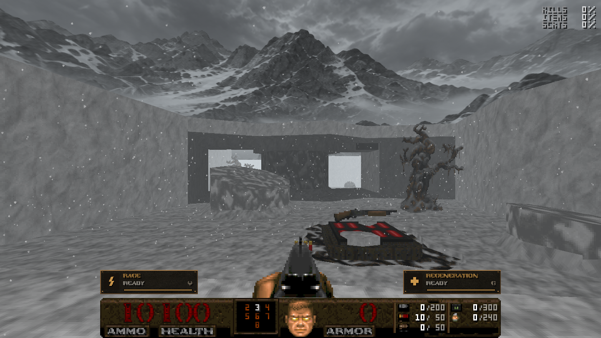
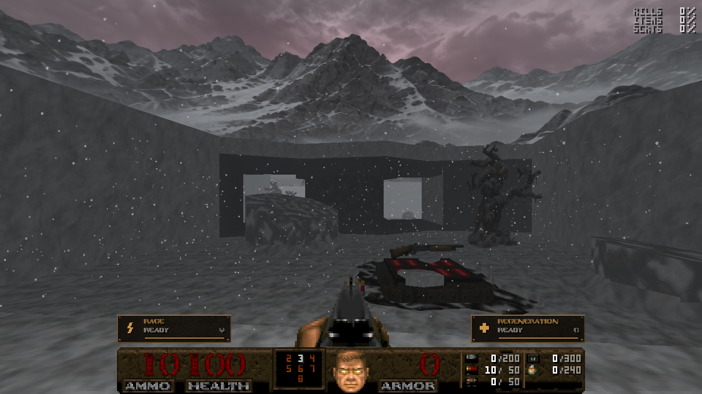
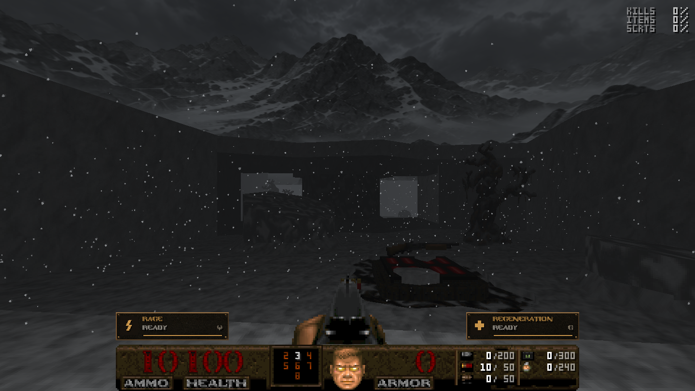
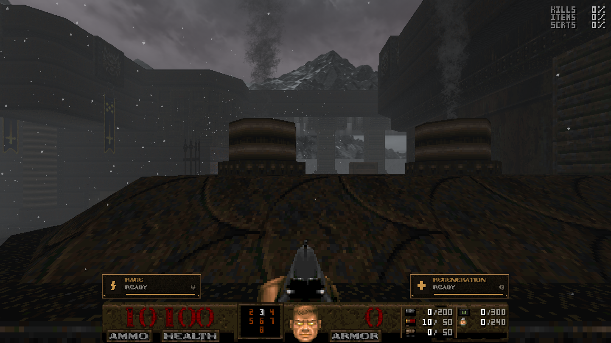

# Cursed Peak engine validation

Actual UZDoom 5.0.1 captures, 2026-09-09; these are not mockups.
`results.json` records isolated-source renderer, hub/save, freeze, co-op,
motion and map-boundary checks. `runtime.log` contains only their assertions
and shared clock diagnostics. Per-file hashes identify the tested runtime.

The light blue-grey grade is shared by sky, mountain lighting and sector fade.
The map ACS fade level remains authoritative. Roofed sectors use their authored
tags; the weather system manages the tinted fog's density.

| Day | Dusk |
| --- | --- |
|  |  |
|  |  |

Additional captures: `storm.png`, `view5.png` (zenith), and `software-day.png`.
Software uses a simpler static cylindrical sky with three lighting states.
OpenGL/Vulkan use the continuous shared sky material.
